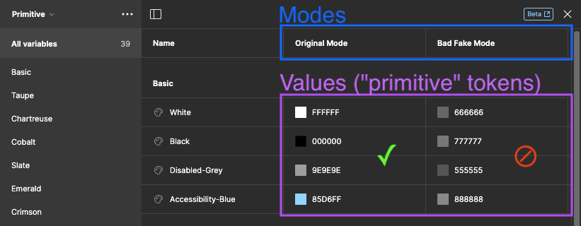
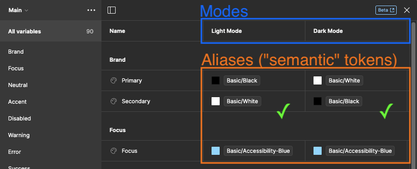

# Figma Design Token API

API for fetching the UX design tokens from Figma (which they call "Variables"), and generating code that is useable by our design system.

Today, this will output the following code:
- Javascript class
- CSS
- Raw JSON of last successful response _from_ Figma
- Raw JSON of last write payload _to_ Figma


## Using The Generated Output


### Javascript Class

The API creates an object with properties grouped by mode (like "Light Mode", "Dark Mode"), then token name. The properties at the top of the generated file represent "semantic" design tokens that should exclusively be used. There are also "primitive" design tokens that could be accessed by the `__primitive` property at the bottom of the file, but they should not ever be needed. If they are, you can use them temporarily to unblock you, but please also have a conversation with the UX team so they can correctly add a semantic design token in Figma, then re-generate this file for you, and update their designs if needed.

Use the generated file by importing it at the top of your code, then call the properties like this:

```js
import designTokens from 'figmaApi/generated/designTokens.js';

const bgColor = designTokens['Light Mode']['Brand/Primary'];
const textColor = designTokens['Light Mode']['Brand/Secondary'];
const fillColor = designTokens['Dark Mode']['Charting/8'];
```

### CSS

The API creates a CSS file which leverages [the custom properties syntax of CSS](https://developer.mozilla.org/en-US/docs/Web/CSS/--*). Because there is no way to code a barrier to entry with plain CSS to restrict the usage of "primitive" design tokens, developers should take care to only call the values at the top of this file which are assigned to `var()`s like these examples:

> ⚠️ **Warning:** These are Case-Sensitive!

```css
.page-body {
    color: var(--DT-Light-Mode-Brand-Primary);
    background-color: var(--DT-Light-Mode-Brand-Secondary);
}
.text-body-regular {
    font-size: var(--DT-Text-body-regular-size);
    font-weight: var(--DT-Text-body-regular-weight);
    font-family: var(--DT-Text-body-regular-typeface);
}
```

```html
<div class="page-body">
    <p class="text-body-regular">
        Some page content
    </p>
</div>
```


### Raw JSON successful response from Figma (Pretty-Printed)

- The last raw response from Figma will be written only if it both:
    - Returned `HTTP 200` with a valid JSON body
    - JSON body contains a `status` property with value `200`
- Otherwise the API will `throw()` an error.


### Raw JSON write (POST) body (Pretty-Printed)

- Useful for debugging
- Written to a file instead of `console.log()` because it can be huge and truncated in the console.


## Known Limitations


### Multiple Mode Values

Specifically for **_Primitive_** design tokens, or variable **_values_**, Figma allows parts of a single design file to use multiple modes. As such, when this API gets variable values, it can't know which mode is in use. Therefore, if a primitive design token has multiple modes (which is bad practice, and shouldn't happen) this API will use the values from the left-most mode and ignore other mode values. The preferred way to add variations of design tokens is through "Semantic" tokens, or variable "aliases" like the second example below.

For example, the gray colors in the `Bad Fake Mode` of this fake example will **_never_** be assigned. Instead, only the `Original Mode` values will be used.



**_Semantic_** tokens, or variable **_aliases_**, however, can have multiple modes (like `Light Mode` and `Dark Mode`), and should work as expected with this API, like the following example:




### Unique Names Between Collections

Figma will allow you to have the same variable name between collections. However, due to the structure of the generated files, we cannot support this. So if you have the same name of a variable between two or more collections, running the API will fail and throw an error message explaining this.


## Executing the API

Set the Figma File Key and PAT (Personal Access Token) in your environment, then use VSCode or a shell to run the API.


### Install Packages

If you haven't already, run:
```sh
npm install --include=dev
```


### File Key

- You can use any key to a file you can view in Figma with your browser. The file key is the part of the URL route between `/file/` and `/Hyphenated-Title...`. For example, if the URL of your design system is `https://www.figma.com/file/aBcDeFgHi12345JkLmNoPq/My-Company-Design-System`, then its file key is `aBcDeFgHi12345JkLmNoPq`.
                                                            

### Personal Access Token

- You need a Full Design Seat for this API to be able to _write_ variables to back to Figma.
    - You can see what access you have in your user settings -> Account tab -> Organizations -> Design Seat.
    - You **do not** need a Full Design Seat if you only want to _read_ the variables, but you will need to
        - Search for: `figma.writeVariables` in [index.mjs](./index.mjs) and comment out that block.
        - > ⚠️ **Warning:**  Generated JS and CSS files will be out of sync with Figma, and should not be used in a production environment!
- Follow [Figma Rest API - Access Tokens](https://www.figma.com/developers/api#access-tokens) to generate your PAT.
    - Set `No access` to the default `File content` scope.
    - Set `Read and Write` to the `Variables` scope (regardless of your license).


### Run the API with VSCode

1. Edit/add `.vscode/launch.json`, and add a `configurations[]` object that looks like this:

    ```JSON
    {
        "name": "Generate Figma Variables",
        "type": "node",
        "program": "${workspaceFolder}${/}figmaApi${/}index.mjs",
        "request": "launch",
        "internalConsoleOptions": "openOnSessionStart",
        "skipFiles": [
            "<node_internals>/**"
        ],
        "env": {
            "FIGMA_FILE_KEY": "(file key)",
            "FIGMA_PAT": "(your PAT)"
        }
    }
    ```

2. Replace `(flie key)` and `(your PAT)` with the values you got from the instructions above.
3. Click "Run and Debug" button on left nav, then run.


### Run the API in a shell

- Set your file key and PAT in your environment by adding them to your favorite `_profile` or `rc` file, then run with npm or node.

    Example using `~/.zshrc` (same would apply to `~/.bash_profile`, `~/.bashrc`, etc.):

    1. Edit `~/.zshrc` and add this, but with the file key and your PAT.

        ```sh
        export FIGMA_FILE_KEY="(file key)"
        export FIGMA_PAT="(your PAT)"
        ```

    2. Execute your changes once

        ```sh
        . ~/.zshrc
        ```

    3. Then all future executions

        ```sh
        npm run getFigmaVariables
        ```

        or

        ```sh
        node figmaApi/index.mjs
        ```


## Executing Unit tests

### Run in VSCode

1. Edit/add `.vscode/launch.json` and add this object to `configurations[]`.

    ```JSON
    {
        "name": "Mocha Tests",
        "type": "node",
        "program": "${workspaceFolder}/node_modules/mocha/bin/_mocha",
        "args": [
            "--timeout",
            "999999",
            "--colors",
            "${workspaceFolder}/test"
        ],
        "internalConsoleOptions": "openOnSessionStart",
        "request": "launch",
        "skipFiles": [
            "<node_internals>/**"
        ]
    }
    ```
2. Run


### Run in Shell

```sh
npm run testFigmaApi
```

or

```sh
./node_modules/mocha/bin/_mocha
```


## From Figma

- [Figma API Example](https://github.com/figma/variables-github-action-example)
